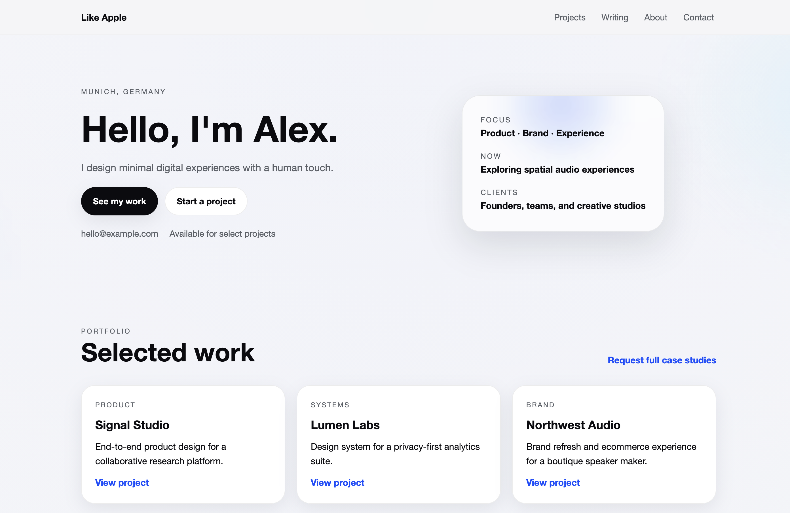

# like apple

Apple-inspired Hugo theme for a personal portfolio and blog.



## Features
- Portfolio-focused homepage with projects, writing, and about sections
- Clean editorial blog layouts
- Smooth motion, gradients, and glass accents
- Responsive design

## Requirements
- Hugo >= 0.112.0

## Installation
Choose one of the options below after you upload the theme to GitHub. Replace `<THEME_REPO_URL>` with your repo URL (e.g. `https://github.com/your-name/like-apple`).

### Option A: Git submodule (recommended)
```bash
hugo new site my-site
cd my-site

git submodule add <THEME_REPO_URL> themes/like-apple
echo 'theme = "like-apple"' >> hugo.toml

hugo server
```

### Option B: Clone + copy
```bash
hugo new site my-site
cd my-site

git clone <THEME_REPO_URL> themes/like-apple
echo 'theme = "like-apple"' >> hugo.toml

hugo server
```

### Option C: Hugo Module
```bash
hugo new site my-site
cd my-site

hugo mod init github.com/your-name/my-site
echo 'theme = ["github.com/your-name/like-apple"]' >> hugo.toml

hugo server
```

## Example site (instant preview)
The repository includes a full starter in `exampleSite/`. The root `hugo.toml` points to it, so you can run a preview without flags.

From the theme root:
```bash
hugo server
```

Or from inside `exampleSite/`:
```bash
hugo server --themesDir ../..
```

### Example content
See `exampleSite/` for a full starter site.

## Configuration
Set the following params in `hugo.toml`:

```toml
[params]
  description = "Designer & developer building calm, useful products."
  heroTitle = "Hello, I'm Alex."
  heroSubtitle = "I design minimal digital experiences with a human touch."
  heroCtaText = "See my work"
  heroCtaLink = "#projects"
  email = "hello@example.com"
  location = "Munich, Germany"

  [[params.social]]
    name = "GitHub"
    url = "https://github.com/you"
  [[params.social]]
    name = "LinkedIn"
    url = "https://linkedin.com/in/you"

  [[params.projectHighlights]]
    title = "Ambient Notes"
    description = "A calm note-taking app that feels like paper."
    url = "https://example.com"
    tag = "Product"
```

## License
MIT License. See [LICENSE](LICENSE).
